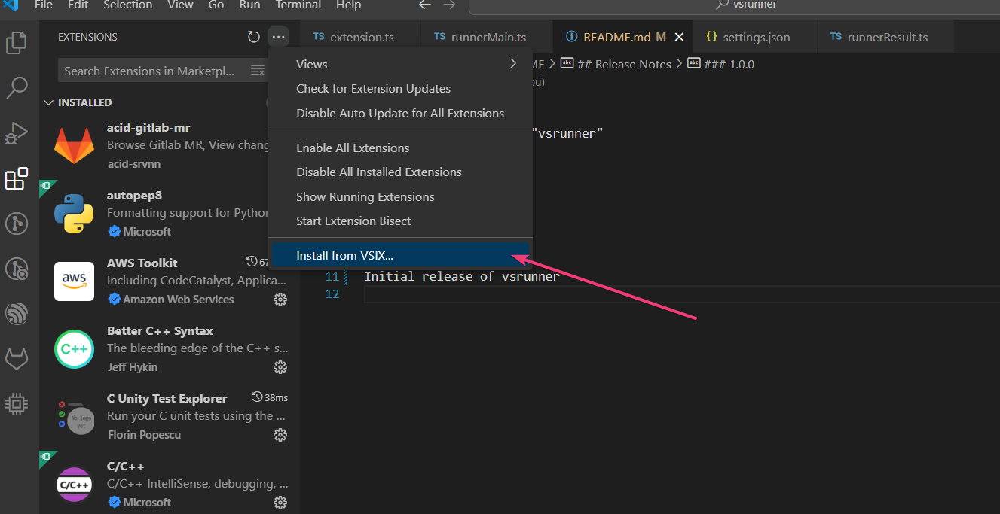
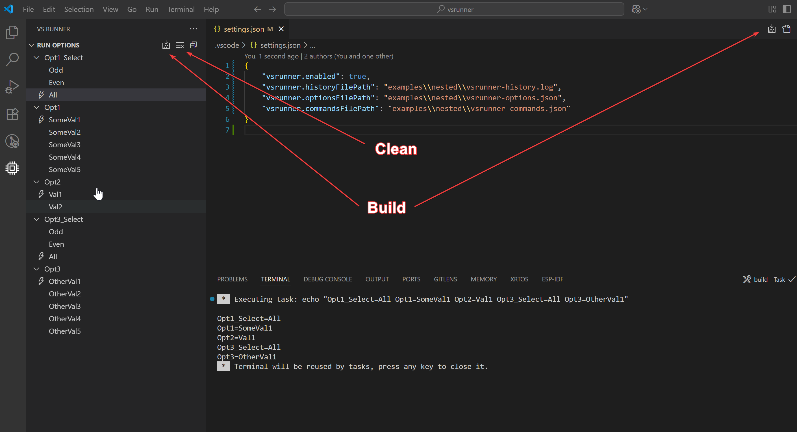

# vsrunner README

## Publish

To publish new version from repository please refer to the official instruction.
The publish to Marketplace after **vsce publish** command takes a few minutes.

https://code.visualstudio.com/api/working-with-extensions/publishing-extension

## Install

To install VSCode extension locally (not recommended) you need to build **"vsrunner-X.X.X.vsix"** file and click "Install from VSIX" in VSCode Extensions menu. The commands to do so:

```shell
npm install
npm install -g typescript
npm install -g @vscode/vsce
vsce package --baseContentUrl https://none --baseImagesUrl https://none
```



## Usage

Select **vsrunner** extension in left activity bar. The extension is disabled by default and enables by options in "settings.json":

```json
    "vsrunner.enabled": true,
    "vsrunner.optionsFilePath": "builds/vsrunner/vsrunner-options.json",
    "vsrunner.optionsFilePath": "builds/vsrunner/vsrunner-commands.json",
    "vsrunner.historyFilePath": "builds/vsrunner/vsrunner-history.json",
```

There are two buttons to use the **vsrunner** - **build** and **clean** the project. If **build** configuration was changed and new **build** was executed without **clean** command, it would be detected by comparing to history file and **clean** command would be executed before **build**.


